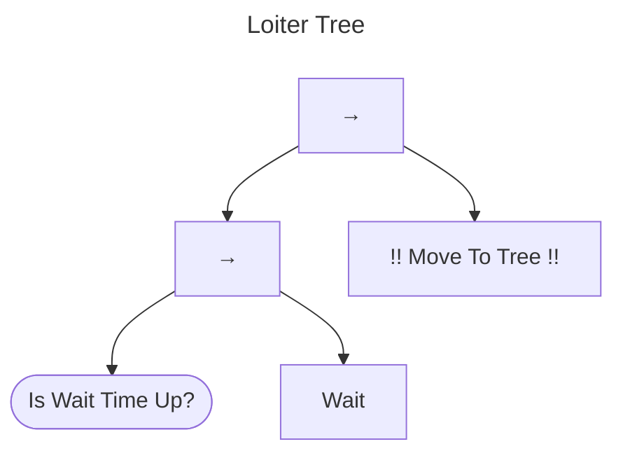
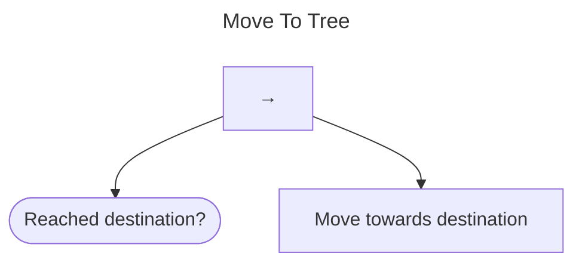

```mermaid
---
title: Loiter Tree
---
flowchart TD
	id1[→]
	id2[→]
	id2_1([Is Wait Time Up?])
	id2_2[Wait]
	id3[!! Move To Tree !!]
	id1 --> id2
	id1 --> id3
	id2 --> id2_1
	id2 --> id2_2
```

```mermaid
---
title: Move To Tree
---
flowchart TD
	id1[→]
	id2([Reached destination?])
	id3[Move towards destination]
	id1 --> id2
	id1 --> id3
```

